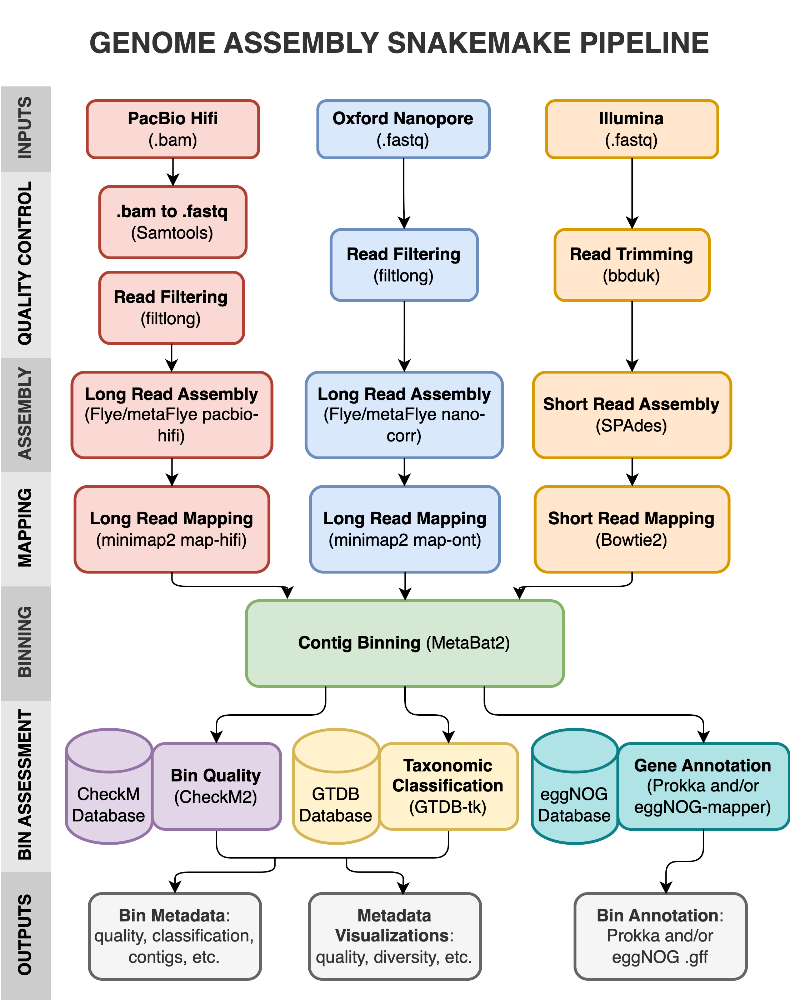
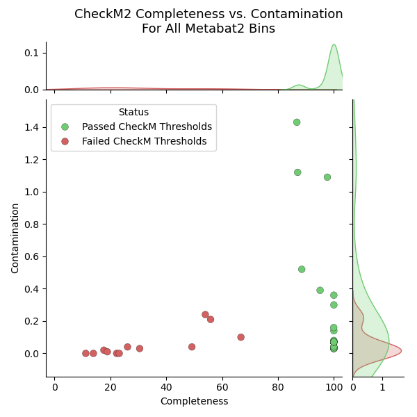
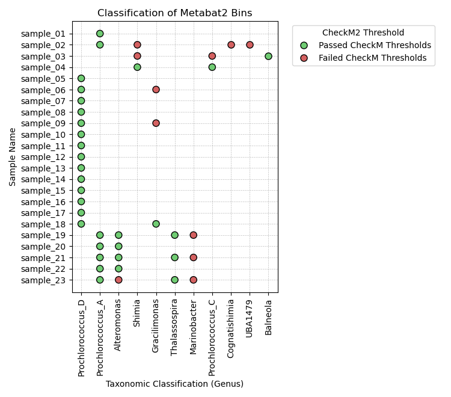

# GenomeAssembly-Snakemake
Genome Assembly, Binning, Classification, and Gene Annotation Snakemake Pipeline for: Illumina, Oxford Nanopore, and PacBio Hifi.



### Visualization
<div style="display: flex; justify-content: space-between;">
  
  
</div>

## Setup
### 1. Install Snakemake and Conda/Mamba  
Install Snakemake and Conda/Mamba following the instructions at this [link](https://snakemake.readthedocs.io/en/stable/getting_started/installation.html#:~:text=for%20installing%20Snakemake.-,Installation%20via%20Conda/Mamba,-This%20is%20the). 

### 2. Download Databases  
#### 1. CheckM2 Database  
Install the checkM2 Database for assembly quality assessment by running script in `inputs/database_dl/` directory:   
  ```
  sbatch checkM2_db_dl.sbatch  
  ```  
Note: this script creates a new conda environment name "genome-assembly-checkm2" and downloads database into the same directory. Change path in script or run script in another folder if preferred. 

#### 2. GTDB-tk Database  
Install the GTDB Database for downstream genome taxonomic classification by running script in `inputs/database_dl/` directory:   
  ```
  sbatch GTDB_dl.sbatch  
  ```  
Note: this script downloads database into the same directory. Change path in script or run script in another folder if preferred.  

#### 2. eggnog Database
Install the eggnog Database by running script in `inputs/database_dl/` directory:   
  ```
  sbatch eggnog_db_dl.sbatch  
  ```  
Note: this script downloads database into the same directory. Change path in script or run script in another folder if preferred.  

### 3.Set up Snakemake Pipeline
#### 1. Edit Experimental Configurations
Edit **config.yaml** file in the `inputs/` Directory:
  - Edit relative path to sample table in line 4
  - Edit "seq data type"
    - Options: "illumina short read", "nanopore long read", pr "pacbio hifi long read"  
  - Edit paths to reference databases in "databases"
  - Edit whether you want gene annotation in "additional output". 
    - prokka gene annotation: annotate bins using prokka. 
    - eggnog gene annotation: add eggnog annotations on genes predicted by prokka.  
  - Edit paths to scratch (intermediate) directory and results directory. 

Create **samples.tsv** file in the `inputs/` Directory: 
  - Create samples.tsv file for your samples with the following required columns (and any other columns for your samples): 
  - Required columns for Illumina samples: ["forward read", "reverse read", "sample"]
    - "forward read" and "reverse read": paths to forward and reverse read .fastq file
    - "sample": unique sample identifier
  - Required columns for Nanopore samples: ["sample", "read path", "metagenomic"]
    - "sample": unique sample identifier
    - "read path": path to .fastq file
    - "metagenomic": whether or not read file is metagenomics. Options: [True, False]
      - This will affect metaflye read assembly (--meta)
  - Required columns for Nanopore samples: ["sample", "bam_path", "metagenomic"]
    - "sample": unique sample identifier
    - "bam_path": path to hifi bam file 
    - "metagenomic": whether or not read file is metagenomics. Options: [True, False]
      - This will affect metaflye read assembly (--meta)
  - Note: 3 example samples.tsv files for each sequencing data type were included in "inputs/example_samples_tsv" directory

#### 2. Edit Resource Specifications 
Edit **config.yaml** file in the `profile/` Directory:
  - Edit number of jobs (samples/processes/rules) to run at once on line 5
  - Edit "default-resources" specifications on line 26
    - Tips: obtain information on comptational resources for config file by: 
      - `sinfo`: shows partitions you have access to, node time limit, and list of node names. 
      - `scontrol show node [node_name]`: displays information about a node in partition. 
        - "CPUTot=[int]": shows how many CPUs (cores) in this node; "cpus_per_task" on line 30 should not exceed this value. 
        - "RealMemory=[int]": shows memory available in thie node; "mem" on line 29 should not exceed this value. 

## Running Pipeline 
### 1. Edit main "run_assembly.sbatch" Script
- Edit name of partition on line 4
- Edit name of conda environment with Snakemake installed on line 10 (if env name is other than "snakemake")

### 2. Submit Script to Cluster
- Submit job to cluster by:  
  ```
  sbatch run_assembly.sbatch
  ```  

## Troubleshooting 
As the pipeline runs, log messages will be saved into file named "main.[slurm_job_ID].err" in the "logs" folder. Here are some tips on debugging: 
- Each rule/job in the pipeline will get its own .err log file. When a rule fails, check the subfolder with the rule's name and sample where it failed. 
- Locked directory: if you get the error message "Error: Directory cannot be locked":
  - Make sure that all jobs from your previous run of the pipeline have completed/cancelled
  - Uncomment line 10 "unlock: True" in `profile/config.yaml` file
  - Run the pipeline following previous step: [Submit Script to Cluster](#2-submit-script-to-cluster)
  - Wait for snakemake to complete running
  - Comment line 10
  - Re-run pipeline, the lock should now be removed  


## Results
**aggregate_table.tsv:** tab-separated file with the following columns:  
- `sample`: unique sample name
- `bin_id`: unique ID for binned assemblie, some samples can have multiple bins
- `bin_contig_num`: number of assembled contigs
- `bin_length`: total nucleotide count in the bin 
- `Completeness`: estimate of fraction of single copy genes expected that were actually found
- `Contamination`: percent of contaminated sequence
- `closest_genome_reference`: what genome in the GTDB database is the bin most closely related to 
- `closest_genome_ani`: average nucleotide identity to the closest genome 
- `warning`: GTDB-tk classification warning  